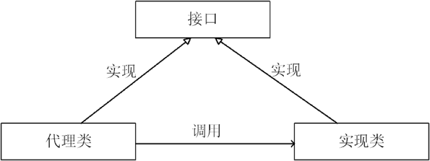
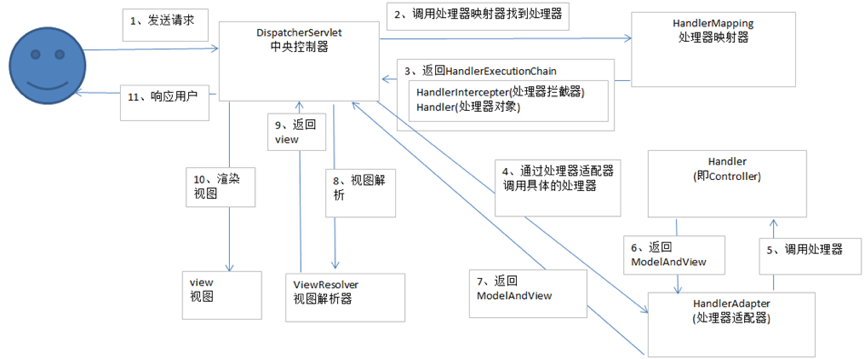

## 义码当仙之Spring

### Spring核心知识  
Spring是一个开源框架，Spring是于2003年兴起的一个轻量级的Java开发框架，由Rod Johnson在其著作Expert One-On-One J2EE Development and Design中阐述的部分理念和原型衍生而来。
它是为了解决企业应用开发的复杂性而创建的。框架的主要优势之一就是其分层架构，分层架构允许使用者选择使用哪一个组件，同时为J2EE应用程序开发提供集成的框架。
Spring使用基本的JavaBean来完成以前只可能由EJB完成的事情。然而，Spring的用途不仅限于服务器端的开发。从简单性、可测试性和松耦合的角度而言，任何Java应用都可以从Spring中受益。
Spring的核心是控制反转（IoC）和面向切面（AOP）。简单来说，Spring是一个分层的JavaSE/EE full-stack（一站式）轻量级开源框架。  

为什么说Spring是一个一站式的轻量级开源框架呢？JavaEE开发可分成三层架构，针对JavaEE的三层结构，每一层Spring都提供了不同的解决技术。  
- WEB层：SpringMVC  
- 业务层：Spring的IoC  
- 持久层：Spring的JDBCTemplate（Spring的JDBC模板，ORM模板用于整合其他的持久层框架）  

从上面的简要介绍中，我们要知道Spring的核心有两部分：  
- IoC：控制反转   
举例来说，在之前的操作中，比方说有一个类，我们想要调用类里面的方法（不是静态方法），就要创建类的对象，使用对象调用方法实现。
对于Spring来说，Spring创建对象的过程，不是在代码里面实现的，而是交给Spring来进行配置实现的。  
- AOP：面向切面编程  

<hr>

### SpringAOP原理

#### 什么是AOP编程
AOP: Aspect Oriented Programming 面向切面编程。  
面向切面编程（也叫面向方面）：Aspect Oriented Programming（AOP），是目前软件开发中的一个热点。利用AOP可以对业务逻辑的各个部分进行隔离，从而使得业务逻辑各部分之间的耦合度降低，提高程序的可重用性，同时提高了开发的效率。  
AOP是OOP的延续，是（Aspect Oriented Programming）的缩写，意思是面向切面（方面）编程。  
主要的功能是：日志记录，性能统计，安全控制，事务处理，异常处理等等。  
主要的意图是：将日志记录，性能统计，安全控制，事务处理，异常处理等代码从业务逻辑代码中划分出来，通过对这些行为的分离，我们希望可以将它们独立到非指导业务逻辑的方法中，进而改变这些行为的时候不影响业务逻辑的代码。  

可以通过预编译方式和运行期动态代理实现在不修改源代码的情况下给程序动态统一添加功能的一种技术。AOP实际是GoF设计模式的延续，设计模式孜孜不倦追求的是调用者和被调用者之间的解耦，AOP可以说也是这种目标的一种实现。  
假设把应用程序想成一个立体结构的话，OOP的利刃是纵向切入系统，把系统划分为很多个模块（如：用户模块，文章模块等等），而AOP的利刃是横向切入系统，提取各个模块可能都要重复操作的部分（如：权限检查，日志记录等等）。由此可见，AOP是OOP的一个有效补充。  
注意：AOP不是一种技术，实际上是编程思想。凡是符合AOP思想的技术，都可以看成是AOP的实现。  

Aop，aspect object programming，面向切面编程  
功能：让关注点代码与业务代码分离！  

#### AOP相关术语  
- 关注点  
重复代码就叫做关注点  

- 切面  
关注点形成的类，就叫切面（类）！  
面向切面编程，就是指对很多功能都有的重复的代码抽取，再在运行的时候往业务方法上动态植入“切面类代码”。  

- 切入点  
执行目标对象方法，动态植入切面代码。可以通过切入点表达式，指定拦截哪些类的哪些方法，给指定的类在运行的时候植入切面类代码。  

#### AOP底层实现原理
- 代理设计模式  

[义码当仙之设计模式：ymdx-design-patterns](https://github.com/ymdx0610/ymdx-design-patterns) 

> 示例项目：ymdx-spring -> spring-aop-proxy  

- 什么是代理模式  
通过代理控制对象的访问，可以详细访问某个对象的方法，在这个方法调用处理，或调用后处理。即AOP微实现，AOP核心技术面向切面编程。  

  

- 代理模式应用场景
SpringAOP、事物原理、日志打印、权限控制、远程调用、安全代理，可以隐蔽真实角色  

- 代理的分类  
静态代理（静态定义代理类）  
动态代理（动态生成代理类）  
Jdk自带动态代理  
Cglib 、javassist（字节码操作库）  

- 静态代理  
- 什么是静态代理  
由程序员创建或工具生成代理类的源码，再编译代理类。所谓静态也就是在程序运行前就已经存在代理类的字节码文件，代理类和委托类的关系在运行前就确定了。  

- 动态代理  
- 什么是动态代理  

1. 代理对象，不需要实现接口  
2. 代理对象的生成，是利用JDK的API，动态的在内存中构建代理对象（需要我们指定创建代理对象／目标对象实现的接口的类型）  
3. 动态代理也叫做：JDK代理，接口代理  

- JDK动态代理  

1）原理：是根据类加载器和接口创建代理类（此代理类是接口的实现类，所以必须使用接口 面向接口生成代理，位于java.lang.reflect包下）  
2）实现方式：  
1. 通过实现InvocationHandler接口创建自己的调用处理器```InvocationHandler handler = new InvocationHandlerImpl(…);```   
2. 通过为Proxy类指定ClassLoader对象和一组interface创建动态代理类```Class clazz = Proxy.getProxyClass(classLoader,new Class[]{…});```   
3. 通过反射机制获取动态代理类的构造函数，其参数类型是调用处理器接口类型```Constructor constructor = clazz.getConstructor(new Class[]{InvocationHandler.class});```   
4. 通过构造函数创建代理类实例，此时需将调用处理器对象作为参数被传入```Interface proxy = (Interface)constructor.newInstance(new Object[] (handler));```    
缺点：jdk动态代理，必须是面向接口，目标业务类必须实现接口  

- CGLIB动态代理  
原理：利用asm开源包，对代理对象类的class文件加载进来，通过修改其字节码生成子类来处理。  
- 什么是CGLIB动态代理
使用cglib[Code Generation Library]实现动态代理，并不要求委托类必须实现接口，底层采用asm字节码生成框架生成代理类的字节码  

- CGLIB动态代理与JDK动态区别  
java动态代理是利用反射机制生成一个实现代理接口的匿名类，在调用具体方法前调用InvokeHandler来处理。  
而cglib动态代理是利用asm开源包，对代理对象类的class文件加载进来，通过修改其字节码生成子类来处理。  
在Spring中，  
1. 如果目标对象实现了接口，默认情况下会采用JDK的动态代理实现AOP  
2. 如果目标对象实现了接口，可以强制使用CGLIB实现AOP  
3. 如果目标对象没有实现了接口，必须采用CGLIB库，spring会自动在JDK动态代理和CGLIB之间转换  

JDK动态代理只能对实现了接口的类生成代理，而不能针对类。  
CGLIB是针对类实现代理，主要是对指定的类生成一个子类，覆盖其中的方法。因为是继承所以该类或方法最好不要声明成final，final可以阻止继承和多态。  

<hr>

### AOP编程使用

#### 注解版本实现AOP
> 示例项目：ymdx-spring -> spring-aop-annotation

#### XML方式实现AOP  
> 示例项目：ymdx-spring -> spring-aop-xml

<hr>

### AOP编程应用场景
日志记录，性能统计，安全控制，事务处理，异常处理  

<hr>  

### Spring事务

#### 事务基本特性
1. 原子性（Atomicity）  
原子性是指事务包含的所有操作要么全部成功，要么全部失败回滚，因此事务的操作如果成功就必须要完全应用到数据库，如果操作失败则不能对数据库有任何影响。  
2. 一致性（Consistency）  
一致性是指事务必须使数据库从一个一致性状态变换到另一个一致性状态，也就是说一个事务执行之前和执行之后都必须处于一致性状态。  
拿转账来说，假设用户A和用户B两者的钱加起来一共是5000，那么不管A和B之间如何转账，转几次账，事务结束后两个用户的钱相加起来应该还得是5000，这就是事务的一致性。  
3. 隔离性（Isolation）  
隔离性是当多个用户并发访问数据库时，比如操作同一张表时，数据库为每一个用户开启的事务，不能被其他事务的操作所干扰，多个并发事务之间要相互隔离。  
即要达到这么一种效果：对于任意两个并发的事务T1和T2，在事务T1看来，T2要么在T1开始之前就已经结束，要么在T1结束之后才开始，这样每个事务都感觉不到有其他事务在并发地执行。  
4. 持久性（Durability）  
持久性是指一个事务一旦被提交了，那么对数据库中的数据的改变就是永久性的，即便是在数据库系统遇到故障的情况下也不会丢失提交事务的操作。  
例如我们在使用JDBC操作数据库时，在提交事务方法后，提示用户事务操作完成，当我们程序执行完成直到看到提示后，就可以认定事务已经正确提交，即使这时候数据库出现了问题，
也必须要将我们的事务完全执行完成，否则就会造成我们看到提示事务处理完毕，但是数据库因为故障而没有执行事务的重大错误。  

#### 事务控制分类
- 编程式事务控制  
自己手动控制事务，就叫做编程式事务控制。  
Jdbc代码：  
```java
conn.setAutoCommite(false);  // 设置手动控制事务
```
Hibernate代码：  
```java
session.beginTransaction();  // 开启一个事务
```
【细粒度的事务控制：可以对指定的方法、指定的方法的某几行添加事务控制】
（比较灵活，但开发起来比较繁琐：每次都要开启、提交、回滚）  

- 声明式事务控制  
Spring提供了对事务的管理, 这个就叫声明式事务管理。  
Spring提供了对事务控制的实现。用户如果想用Spring的声明式事务管理，只需要在配置文件中配置即可；不想使用时直接移除配置。这个实现了对事务控制的最大程度的解耦。  
Spring声明式事务管理，核心实现就是基于Aop。  
【粗粒度的事务控制：只能给整个方法应用事务，不可以对方法的某几行应用事务。】（因为aop拦截的是方法）  
Spring声明式事务管理器类：  
Jdbc技术：DataSourceTransactionManager  
Hibernate技术：HibernateTransactionManager  

<hr>

### 手写Spring事务框架

#### 编程事务实现
- 概述  
所谓编程式事务指的是通过编码方式实现事务，即类似于JDBC编程实现事务管理。管理使用TransactionTemplate或者直接使用底层的PlatformTransactionManager。
对于编程式事务管理，spring推荐使用TransactionTemplate。  

- 案例：使用编程事务实现手动事务  
使用编程事务实现，手动事务 begin、commit、rollback  
> 示例代码：

- AOP技术封装手动事务  
> 示例代码：

- 使用事务注意事项  
事务是程序运行如果没有错误，会自动提交事务，如果程序运行发生异常，则会自动回滚。  
如果使用了try捕获异常时，一定要在catch里面手动回滚。  

事务手动回滚代码  
```java
TransactionAspectSupport.currentTransactionStatus().setRollbackOnly();  
```

#### 声明事务实现
- 概述  
管理建立在AOP之上的。其本质是对方法前后进行拦截，然后在目标方法开始之前创建或者加入一个事务，在执行完目标方法之后根据执行情况提交或者回滚事务。
声明式事务最大的优点就是不需要通过编程的方式管理事务，这样就不需要在业务逻辑代码中掺杂事务管理的代码，只需在配置文件中做相关的事务规则声明（或通过基于@Transactional注解的方式），便可以将事务规则应用到业务逻辑中。  
显然声明式事务管理要优于编程式事务管理，这正是spring倡导的非侵入式的开发方式。  
声明式事务管理使业务代码不受污染，一个普通的POJO对象，只要加上注解就可以获得完全的事务支持。和编程式事务相比，声明式事务唯一不足地方是，后者的最细粒度只能作用到方法级别，无法做到像编程式事务那样可以作用到代码块级别。
但是即便有这样的需求，也存在很多变通的方法，比如，可以将需要进行事务管理的代码块独立为方法等等。  

- XML实现声明  

- 注解版本声明  
> 示例代码：

用法：  
```java
@Transactional(rollbackFor = Exception.class)
public void add() {
    String sql = "insert into t_user(name, age) values(?, ?);";
    int ymdx001 = jdbcTemplate.update(sql, "ymdx001", 18);
    if (ymdx001 > 0)
        System.out.println("ymdx001插入成功！");
}
```
> 示例项目：ymdx-spring -> spring-aop-transaction


#### 手写Spring注解版本事务
- 注解  
Jdk1.5新增新技术，注解。很多框架为了简化代码，都会提供有些注解。可以理解为插件，是代码级别的插件，在类的方法上写：@XXX，就是在代码上插入了一个插件。  
注解不会也不能影响代码的实际逻辑，仅仅起到辅助性的作用。  
注解分类：内置注解（也成为元注解，jdk自带注解）、自定义注解（Spring框架）  

- 什么是内置注解  

1. @SuppressWarnings：在程序前面加上可以在javac编译中去除警告--阶段是SOURCE  
2. @Deprecated：带有标记的包，方法，字段说明其过时--阶段是SOURCE  
3. @Override：打上这个标记说明该方法是将父类的方法重写--阶段是SOURCE  

- @Override案例演示  
```java
@Override
public String toString() {
    return null;
}
```
- @Deprecated案例演示  
```java
new Date().parse("");
```
- @SuppressWarnings案例演示  
```java
@SuppressWarnings({ "all" })
public void save() {
    java.util.List list = new ArrayList();
}
```

- 实现自定义注解  
元注解的作用就是负责注解其他注解。Java5.0定义了4个标准的meta-annotation类型，它们被用来提供对其它annotation类型作说明。Java5.0定义的元注解：  

1、@Target  
@Target说明了Annotation所修饰的对象范围：Annotation可被用于packages、types（类、接口、枚举、Annotation类型）、类型成员（方法、构造方法、成员变量、枚举值）、方法参数和本地变量（如循环变量、catch参数）。在Annotation类型的声明中使用了target可更加明晰其修饰的目标。  
```text
CONSTRUCTOR：用于描述构造器  
FIELD：用于描述域  
LOCAL_VARIABLE：用于描述局部变量  
METHOD：用于描述方法  
PACKAGE：用于描述包  
PARAMETER：用于描述参数  
TYPE：用于描述类、接口（包括注解类型）或enum声明 
```
2、@Retention  
表示需要在什么级别保存该注释信息，用于描述注解的生命周期（即：被描述的注解在什么范围内有效）  

3、@Documented  

4、@Inherited  

使用@interface定义注解  
```java
@Target(value = { ElementType.METHOD })
@Retention(RetentionPolicy.RUNTIME)
public @interface AddAnnotation { 
    int userId() default 0;
    String userName() default "默认名称";
	String[]arrays();
}
```
反射读取注解信息  
```java
@Target({ElementType.ANNOTATION_TYPE,ElementType.METHOD})
@Retention(RetentionPolicy.RUNTIME)
public @interface MyAnnotation {

    String name() default "ymdx2020";
    int age() default 30;

}

public class MyAnnotationDemo {

    @MyAnnotation // (name = "test001", age = 1)
    public void test(){

    }

    public static void main(String[] args) {
        try {
            Class<?> cls = Class.forName("com.ymdx.spring.aop.transaction.annotation.MyAnnotationDemo");
            Method[] methods = cls.getDeclaredMethods();
            for(Method method : methods){
                MyAnnotation myAnnotation = method.getDeclaredAnnotation(MyAnnotation.class);
                if(null == myAnnotation)
                    continue;
                String name = myAnnotation.name();
                int age = myAnnotation.age();
                System.out.printf("name = " + name + "; age = " + age);
            }
        }catch (Exception e){
            e.printStackTrace();
        }
    }

}
```  

自定义事务注解，自定义@MyTransactional，实现Spring自带的@Transactional一样的功能  
步骤：  
1. 定义事务注解   
2. 封装编程式事务  
3. 扫包，定义一个事务扫包AOP（具体拦截哪些方法）  
4. 拦截方法的时候，使用反射技术判断该方法上是否有事务注解，若有，则开启事务，没有，就不开启事务  

> 示例项目：ymdx-spring -> spring-aop-transaction-customize  

#### Spring事务传播行为  
Spring中事务的定义：  
Propagation（key属性，确定代理应该给哪个方法增加事务行为。这样的属性最重要的部分是传播行为。）有以下选项可供使用：  
- PROPAGATION_REQUIRED：如果当前有事务，就用当前事务，如果当前没有事务，就新建一个事务。这是最常见的选择。  
- PROPAGATION_SUPPORTS：支持当前事务，如果当前没有事务，就以非事务方式执行。// 如果外层方法没有事务，就会以非事务方式执行。
- PROPAGATION_MANDATORY：支持当前事务，如果当前没有事务，就抛出异常。 
- PROPAGATION_REQUIRES_NEW：新建事务，如果当前存在事务，把当前事务挂起。 
- PROPAGATION_NOT_SUPPORTED：以非事务方式执行操作，如果当前存在事务，就把当前事务挂起。// 如果当前有事务，就会以非事务方式执行。  
- PROPAGATION_NEVER：以非事务方式执行，如果当前存在事务，则抛出异常。  
- PROPAGATION_NESTED：如果当前存在事务，则在嵌套事务内执行。如果当前没有事务，则执行与PROPAGATION_REQUIRED类似的操作。  

默认传播行为为PROPAGATION_REQUIRED  

<hr>

### SpringIOC原理  

#### XML技术
- 什么是XML  
它是可扩展标记语言（Extensible Markup Language，简称XML），是一种标记语言。  
XML 全称为可扩展的标记语言。主要用于描述数据和用作配置文件。  
XML 文档在逻辑上主要由一下 5 个部分组成：  
1. XML 声明：指明所用 XML 的版本、文档的编码、文档的独立性信息  
2. 文档类型声明：指出 XML 文档所用的 DTD  
3. 元素：由开始标签、元素内容和结束标签构成  
4. 注释：以结束，用于对文档中的内容起一个说明作用  
5. 处理指令：通过处理指令来通知其他应用程序来处理非 XML 格式的数据  
XML 文档的根元素被称为文档元素，它和在其外部出现的处理指令、注释等作为文档实体的子节点，根元素本身和其内部的子元素也是一棵树。 

- XML样例  
```xml

```
```<?xml version="1.0" encoding="UTF-8"?>```
作用xml文件头部要写的话，说明了xml的版本和编码，utf-8一般是网络传输用的编码  

- XML解析方式  
Dom4j、Sax、Pull  

- Dom4j与Sax区别  
dom4j不适合大文件的解析，因为它是一下子将文件加载到内存中，所以有可能出现内存溢出，sax是基于事件来对xml进行解析的，所以他可以解析大文件的xml，
也正是因为如此，所以dom4j可以对xml进行灵活的增删改查和导航，而sax没有这么强的灵活性，所以sax经常是用来解析大型xml文件，而要对xml文件进行一些灵活（crud）操作就用dom4j。  

- 使用dom4j解析xml  
解析XML过程是通过获取Document对象，然后继续获取各个节点以及属性等操作，因此获取Document对象是第一步，大体说来，有三种方式：  
1、自己创建Document对象  
```java
Document document = DocumentHelper.createDocument();
Element root = document.addElement("students");
```
其中students是根节点，可以继续添加其他节点等操作。  

2、自己创建Document对象
```java
// 创建SAXReader对象
SAXReader reader = new SAXReader();
// 读取文件 转换成Document
Document document = reader.read(new File("XXXX.xml"));
```

3、读取XML文本内容获取Document对象
```java
String xmlStr = "<students>......</students>";
Document document = DocumentHelper.parseText(xmlStr);
```

- 解析xml代码  
> 示例代码：

- XML与JSON区别  
Xml是重量级数据交换格式，占宽带比较大。  
JSON是轻量级交换格式，xml占宽带小。  
所以很多互联网公司都会使用json作为数据交换格式  
很多银行项目，大多数还是在使用xml。  

#### 什么是SpringIOC  
spring ioc指的是控制反转，IOC容器负责实例化、定位、配置应用程序中的对象及建立这些对象间的依赖。交由Spring来管理这些，实现解耦  

#### SpringIOC原理
使用反射机制 + XML技术  

#### 手写SpringIOC XML版本
> 示例代码：

#### 手写SpringIOC 注解版本
> 示例代码：

#### 常用反射工具类

#### Maven相关依赖

#### SpringIOC容器核心接口

<hr>  

### SpringMVC原理

#### SpringMVC的运行流程 

  

1. 用户发送请求至前端控制器DispatcherServlet  
2. DispatcherServlet收到请求调用HandlerMapping处理器映射器。  
3. 处理器映射器根据请求url找到具体的处理器，生成处理器对象及处理器拦截器(如果有则生成)一并返回给DispatcherServlet。  
4. DispatcherServlet通过HandlerAdapter处理器适配器调用处理器  
5. 执行处理器(Controller，也叫后端控制器)。  
6. Controller执行完成返回ModelAndView  
7. HandlerAdapter将controller执行结果ModelAndView返回给DispatcherServlet  
8. DispatcherServlet将ModelAndView传给ViewResolver视图解析器  
9. ViewResolver解析后返回具体View  
10. DispatcherServlet对View进行渲染视图（即将模型数据填充至视图中）。  
11. DispatcherServlet响应用户。  

#### 回顾Servlet知识  

- 什么是Servlet  
Java Servlet 是运行在 Web 服务器或应用服务器上的程序，它是作为来自 Web 浏览器或其他 HTTP 客户端的请求和 HTTP 服务器上的数据库或应用程序之间的中间层。  
使用 Servlet，可以收集来自网页表单的用户输入，呈现来自数据库或者其他源的记录，还可以动态创建网页。  
Java Servlet 通常情况下与使用 CGI（Common Gateway Interface，公共网关接口）实现的程序可以达到异曲同工的效果。但是相比于 CGI，Servlet 有以下几点优势：性能明显更好。  
Servlet 在 Web 服务器的地址空间内执行。这样它就没有必要再创建一个单独的进程来处理每个客户端请求。  
Servlet 是独立于平台的，因为它们是用 Java 编写的。  
服务器上的 Java 安全管理器执行了一系列限制，以保护服务器计算机上的资源。因此，Servlet 是可信的。  
Java 类库的全部功能对 Servlet 来说都是可用的。它可以通过 sockets 和 RMI 机制与 applets、数据库或其他软件进行交互。  

- Servlet生命周期  
加载 —> 实例化 —> 服务 —> 销毁  
init()：  
在Servlet的生命周期中，仅执行一次init()方法。它是在服务器装入Servlet时执行的，负责初始化Servlet对象。
可以配置服务器，以在启动服务器或客户机首次访问Servlet时装入Servlet。无论有多少客户机访问Servlet，都不会重复执行init()。  
service()：  
它是Servlet的核心，负责响应客户的请求。每当一个客户请求一个HttpServlet对象，该对象的Service()方法就要调用，
而且传递给这个方法一个“请求”（ServletRequest）对象和一个“响应”（ServletResponse）对象作为参数。在HttpServlet中已存在Service()方法。默认的服务功能是调用与HTTP请求的方法相应的do功能。  
destroy()：  
仅执行一次，在服务器端停止且卸载Servlet时执行该方法。当Servlet对象退出生命周期时，负责释放占用的资源。
一个Servlet在运行service()方法时可能会产生其他的线程，因此需要确认在调用destroy()方法时，这些线程已经终止或完成。  

#### 手写SpringMVC思路
1、web.xml加载  
为了读取web.xml中的配置，我们用到ServletConfig这个类，它代表当前Servlet在web.xml中的配置信息。通过web.xml中加载我们自己写的MyDispatcherServlet和读取配置文件。  
2、初始化阶段  
在前面我们提到DispatcherServlet的initStrategies方法会初始化9大组件，但是这里将实现一些SpringMVC的最基本的组件而不是全部，按顺序包括：
- 加载配置文件  
- 扫描用户配置包下面所有的类  
- 拿到扫描到的类，通过反射机制，实例化。并且放到ioc容器中（Map的键值对 beanName-bean）beanName默认是首字母小写  
- 初始化HandlerMapping，这里其实就是把url和method对应起来放在一个k-v的Map中，在运行阶段取出  

3、运行阶段  
每一次请求将会调用doGet或doPost方法，所以统一运行阶段都放在doDispatch方法里处理，它会根据url请求去HandlerMapping中匹配到对应的Method，然后利用反射机制调用Controller中的url对应的方法，并得到结果返回。按顺序包括以下功能：
- 异常的拦截  
- 获取请求传入的参数并处理参数  
- 通过初始化好的handlerMapping中拿出url对应的方法名，反射调用  

#### 手写SpringMVC基本实现
> 示例代码： 


